# CSARCH2 Case Study 1: Computing Machine
## Group 6 CSARCH2-S04

## Screenshot Outputs

### Conversion

#### Normal
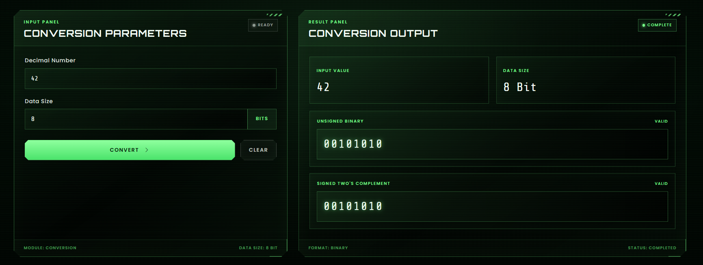

#### Special
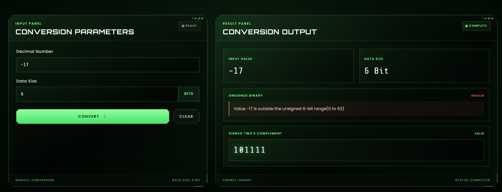

#### Edge
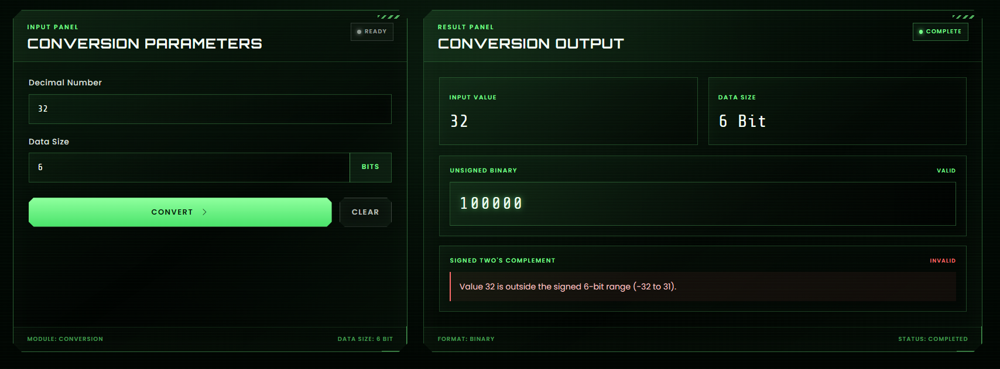

#### Different Input
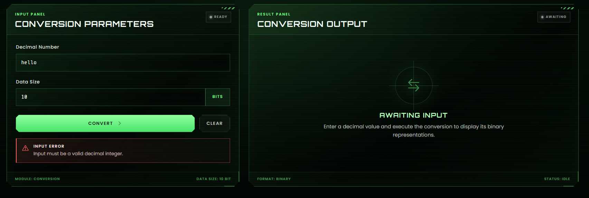

### Multiplication

#### Normal
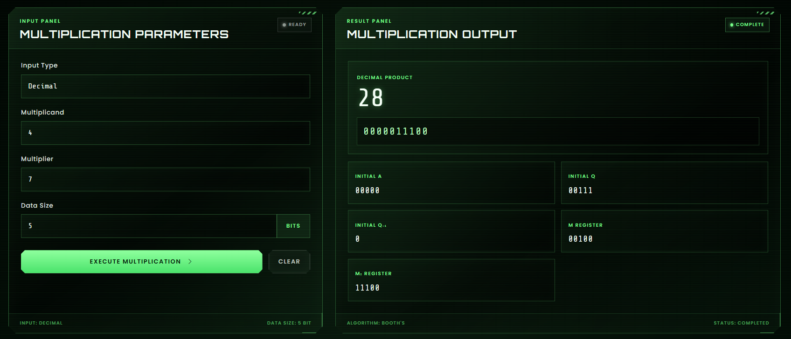
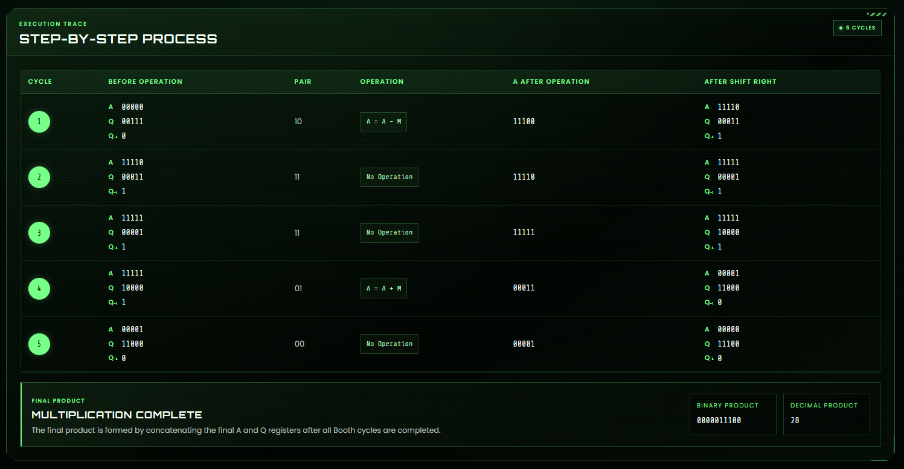

#### Special
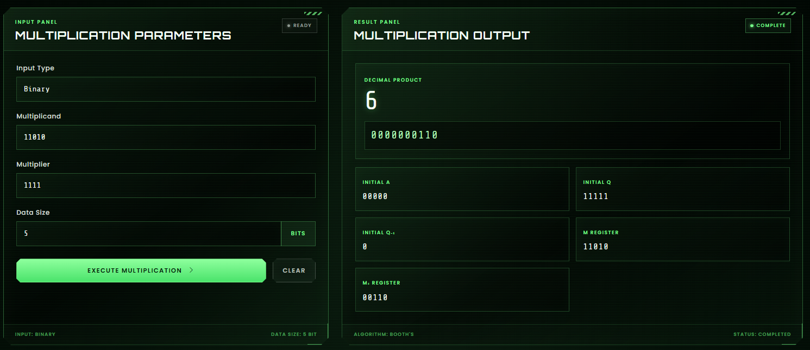
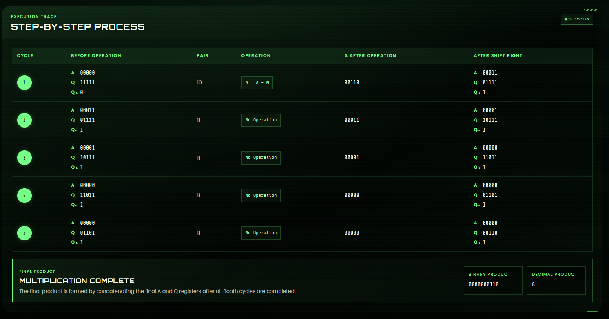

#### Edge
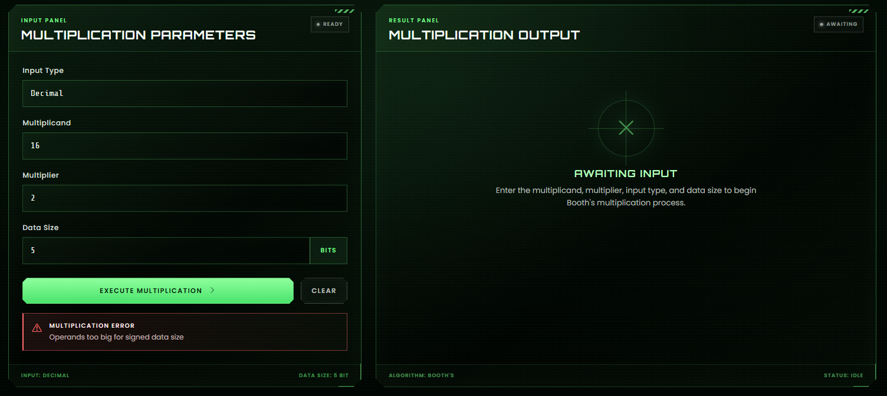

#### Different Input
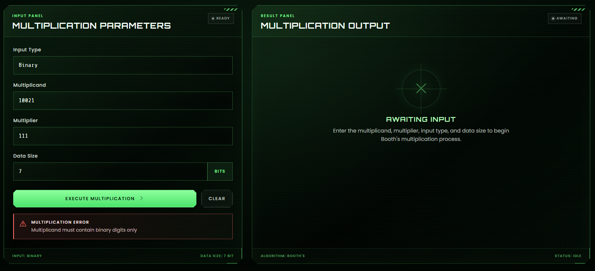

### Division

#### Normal
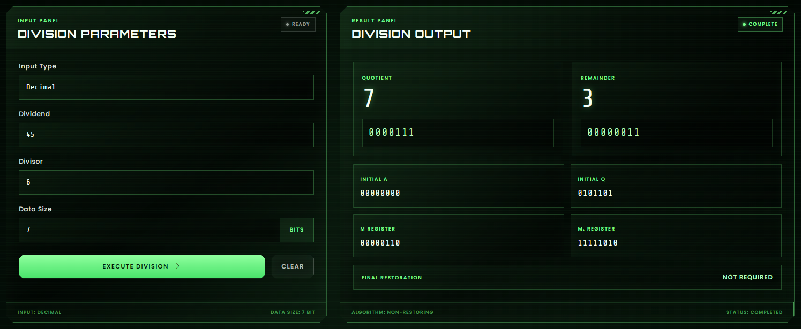
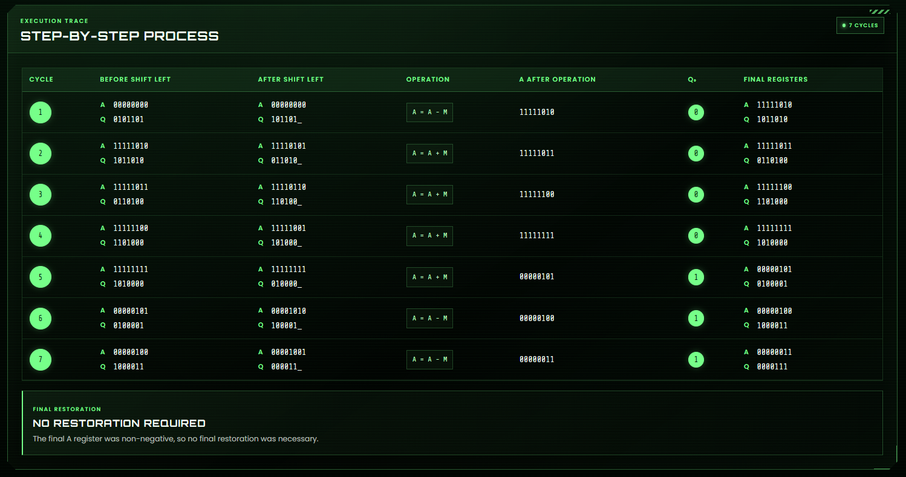

#### Special
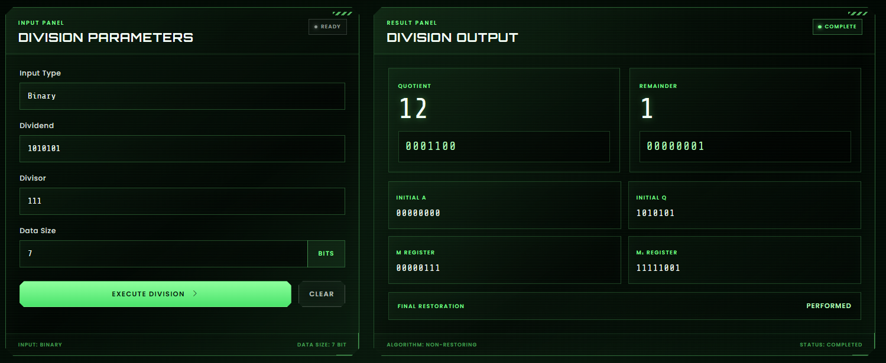
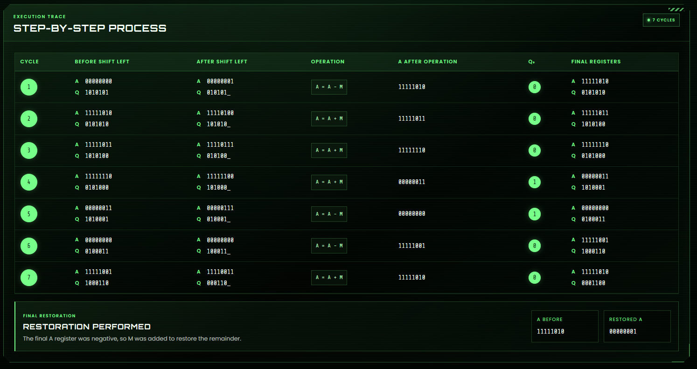

#### Edge

#### Different Input
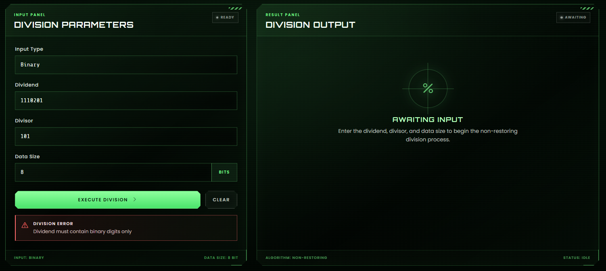

## Video Walkthrough
[CSARCH2 Integer Machine Demo](https://youtu.be/RMndn7gSBW0)

## Specifications:
**General Directions:**
- Application platform: Web-based application with a Graphical User Interface (GUI).
- Programming languages: Any programming language of your choice.
- Application repository: GitHub (must contain the source code and analysis write-up). Ensure the
repository is set to public or that the instructor is granted access.

**Required Outputs (All stored in the GitHub repository):**
* a.) Screenshots: Capture the program output for all possible test cases covering the specifications (normal cases,
special cases, edge cases, different inputs, etc.).
* b.) Video Walkthrough: A 5 to 8-minute video demonstrating the system on YouTube. Include the link in the GitHub README.md. Ensure both the GitHub repository and the YouTube video are accessible. The video must:
	- Prove that the program is functioning correctly.
	- Show all test cases covering the specifications (normal, special cases, different inputs, etc.).
* c.) Source Code: Complete and well-commented source code.
* d.) Deployment Link: Include the live website deployment link in the "About" / "Website" section of the GitHub repository.
* e.) Project Demo: A live project demo may be required if needed. This can be conducted face-to-face or via Zoom.

**Machine 1: Integer Machine**
Process: Integer arithmetic and conversion.
1. Convert decimal to unsigned and signed binary
	* a. Input: A decimal number.
	* b. Input: Data size (ranging from 2 bits to 64 bits and beyond).
	* c. Output: Both unsigned and signed binary representations (must include error checking for out-of-bounds values).
2. Perform multiplication (sequential circuit binary multiplier), and division (non-restoring)
	* a. Input: Operands in either decimal (which must be converted to binary internally) or binary format.
	* b. Input: Data size (in bits).
	* c. Output: The step-by-step solution and the final result

## Incremental Progress

**July 27, 2026**
- initialized React project with Vite
- implemented, displayed, and fully tested conversion algorithm

**July 30, 2026**
- implemented DivisionStates and DivisionResult, added partial pseudocode for division function
- planned and drafted the Vitest test cases for the non-restoring division implementation
- began conceptualizing the user interface and identified reusable design elements from the previous CSARCH2 project

**July 31, 2026**
- implemented 2's complement and binary addition helper functions, added input checking and formatting for division operands, implemented non-restoring division
- Started adapting the previous project's UI components for the Integer Machine interface

**August 1, 2026**
- completed and expanded the division Vitest test suite
- strengthened division input validation and handled additional edge cases
- added step-by-step state recording for the non-restoring division algorithm to support solution visualization

**August 2, 2026**
- designed the user interface using Bootstrap components combined with recycled CSARCH2 UI elements
- built the home page and module layouts
- implemented responsive layouts for different screen sizes
- integrated the completed multiplication implementation into the interface
- Implemented Booth's Multiplication algorithm.
- Added support for decimal and binary operands.
- Implemented Booth operation selection using the Q₀Q₋₁ bit pair.
- Implemented addition and subtraction using two's complement.
- Added arithmetic right shift after each iteration.
- Recorded register states (A, Q, Q₋₁, M, and M₂) for visualization.
- Generated final binary and decimal product outputs.

**August 3, 2026**
- Refactored multiplication implementation.
- Improved input validation and error handling.
- Fixed Booth subtraction using two's complement.
- Improved register state tracking and iteration logging.
- Added comprehensive Vitest unit tests.
- Started transition from unsigned to signed Booth multiplication.
- finalized the application design and layout
- improved responsiveness, typography, and overall readability
- performed final UI testing and polishing to ensure everything functions correctly

## References
- CSARCH2 Lecture Materials: Module 2 - Integer Data Type
- CSARCH2 Lecture Materials: Module 9 - Binary Multiplication
- CSARCH2 Lecture Materials: Module 10 - Unsigned Binary Division

## AI Disclosure
The group declares that this assignment is entirely our own work and ideas. All written content, research, programming, and implementation were completed entirely by the group.